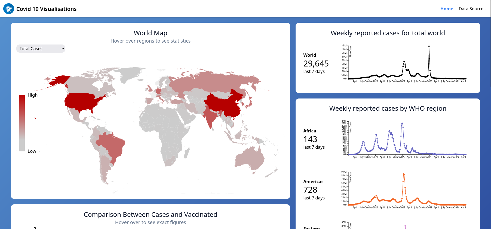

# COVID-19 Visualisation: An HCI Assignment


## Data Sources
Data sources are saved in the [`static`](./static/) directory and contain the following:

- **WHO Historical Deaths and Cases by Country**: Death and Case statistics historically to the start of COVID-19 to current (csv). Updated Weekly. Provided under the Creative Commons License 4.0
- **Our World in Data**: Death and Case statistics historical and latest to the start of COVID-19 to current (csv). Additional file has pre-processed data in to quarterly iterations. Provided under the Creative Commons License 4.0.


## Get Started

Install dependencies

```bash
npm install
```

### Run in development mode
```bash
npm run dev

# or start the server and open the app in a new browser tab
npm run dev -- --open
```

### Building

To create a production version of the app:

```bash
npm run build
```


## Design

This interactive dashboard features a dynamic array of widgets that automatically adjust to fit any screen size, ensuring a seamless mobile experience. It offers a comprehensive display of COVID-19 statistics through various engaging visualizations, providing users with a clear and accessible way to monitor pandemic trends.

